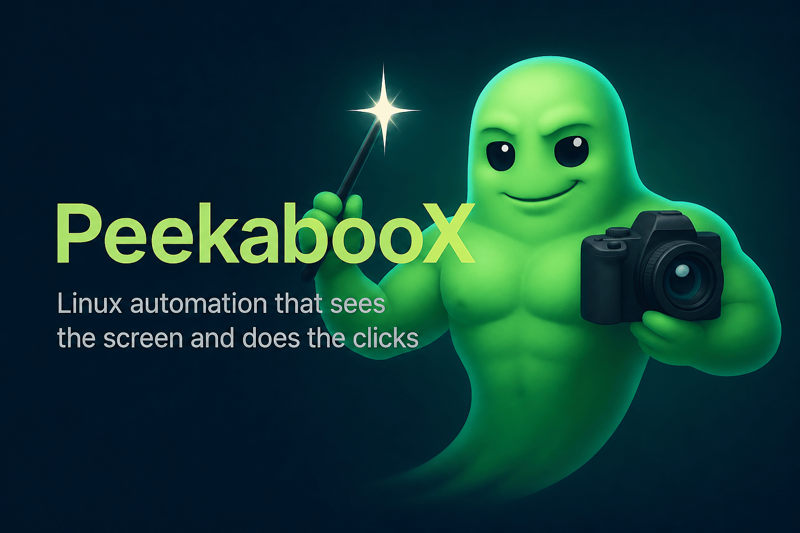

# PeekabooX - Linux automation that sees the screen and does the clicks.
 [](https://github.com/nordbyte/PeekabooX/releases/latest) [](https://github.com/nordbyte/PeekabooX/actions/workflows/ci.yml) [](LICENSE) [](docs/cli.md) [](Cargo.toml) [](python/pyproject.toml)

PeekabooX brings screen capture, semantic desktop inspection, safe input automation, workflow execution, plugins, and MCP-ready agent runtime APIs to Linux.

Current main includes exact window scoping, desktop action verification, a
doctor command, a desktop profile registry, advanced OCR controls, structured
JSON output, runnable examples, and release-grade packaging.

## What you get

- Linux desktop capture for full screen, regions, and windows, with Wayland,
  GNOME, KDE, wlroots, X11, and optional PipeWire DMA-BUF/EGL paths.
- Rust CLI and daemon with gRPC plus local newline-delimited JSON IPC.
- Semantic UI lookup through AT-SPI, with OCR and vision fallback primitives
  when accessibility data is missing.
- Action-first automation for clicks, movement, drag, text, paste, and hotkeys,
  with dry-run checks and daemon-side permission gates.
- Desktop helper profiles for Telegram, paint/drawing apps, and text editors,
  including `window_id` targeting and post-action `--verify` checks.
- Python runtime, MCP server, workflow generation/replay, Doctor-backed
  preflight gating, semantic desktop graph memory, and JSONL audit hooks.
- Directory-based Plugin SDK with manifest validation, bounded process tools,
  CLI, daemon, gRPC, Python, and MCP integration.
- Local packaging for Rust binaries, Python wheels, Debian packages, Docker
  smoke images, Nix shells, release manifests, and checksums.
- Categorized environment diagnostics through `peekaboox doctor`, including
  capture, window, input, OCR, Python gRPC, and desktop-profile checks.

## Install

- Download release artifacts from
  [GitHub Releases](https://github.com/nordbyte/PeekabooX/releases/latest).
- Debian package and Python wheel:

```bash
sudo apt install ./peekaboox_*.deb
python3 -m pip install ./peekaboox-*.whl
```

- Rust CLI + daemon from source:

```bash
packaging/install-rust.sh
```

- Python runtime + MCP server from source:

```bash
python3 -m pip install ./python
```

- Local wheel and Debian package builds:

```bash
python3 -m pip wheel --no-deps -w target/python-wheel ./python
python3 packaging/debian/build_deb.py
```

For package contents, Docker, Nix, and smoke-install checks, see
[packaging/README.md](packaging/README.md).

## Quick start

```bash
# Check the current desktop/session capabilities.
peekaboox doctor --json

# Capture a full screen, region, or known window.
peekaboox capture --output screenshot.png
peekaboox capture --region 10,20,400,240 --output region.png
peekaboox capture --window-id window-1 --output window.png
peekaboox capture --app calculator --title-regex Calculator --json --output calculator.png
peekaboox capture --stdout > screenshot.png
peekaboox capture --format jpeg --quality 85 --output screenshot.jpg
peekaboox see --annotate --json

# Inspect windows and semantic UI elements.
peekaboox windows --json
peekaboox window focus --app calculator
peekaboox windows --focused --limit 1 --sort focused --json
peekaboox windows --app calculator --title-regex "Calculator" --diagnose --json
peekaboox elements --selector "role=push button,label=Submit" --vision-fallback

# Drive named desktop targets without hard-coded coordinates.
peekaboox desktop profiles --json
peekaboox desktop focus --app telegram
peekaboox desktop click --app telegram --target search-input --dry-run --verify --json

# Start the local daemon for agent-facing APIs.
peekabooxd run --profile operator
peekaboox --daemon capture-delta --stream agent-loop --low-bandwidth

# Run the MCP server from a checkout.
PYTHONPATH=python/src python3 -m peekaboox.mcp.server --list-tools
PYTHONPATH=python/src python3 -m peekaboox.mcp.server
PYTHONPATH=python/src python3 -m peekaboox.mcp.server --transport http --port 47778
PYTHONPATH=python/src python3 -m peekaboox.mcp.server --transport sse --port 47778

# Run structured runtime/MCP diagnostics examples.
PYTHONPATH=python/src python3 examples/python/doctor_runtime.py
PYTHONPATH=python/src bash examples/mcp/jsonrpc_doctor.sh
```

Live examples are documented in [examples/README.md](examples/README.md). They
cover desktop smoke checks, capture-backend and capture-delta diagnostics across
CLI/Python/MCP, scoped accessibility element inspection, real Calculator window
inventory, visible-window OCR, paint drawing and saving, Text Editor save
dialogs, and Telegram Saved Messages automation.

## Shell completions

PeekabooX exposes command metadata through built-in help and shell completion
generators:

```bash
peekaboox
peekaboox desktop
peekaboox capture --help
peekaboox tools
peekaboox completions bash
peekaboox completions zsh
peekaboox completions fish
```

| Command | Key flags / subcommands | What it does |
| --- | --- | --- |
| [capture](docs/cli.md#capture) | `--output`, `--region`, `--window-id`, `--app`, `--title-regex`, `--format`, `--quality`, `--json`, `--stdout` | Save a screenshot from the active desktop session |
| [see](docs/cli.md#snapshots-agent-and-system-commands) | `--annotate`, `--output-dir`, `--id`, `--json` | Persist a snapshot image plus semantic metadata |
| [capture-delta](docs/cli.md#capture-delta) | `--stream`, `--low-bandwidth`, `--reset`, `--json` | Return full-frame or changed-rectangle capture deltas |
| [capture-backends](docs/cli.md#capture-backends-and-dma-buf) | `--json`, `--diagnose`, `--probe`, `--output`, `--format` | Inspect and probe screenshot and zero-copy backends |
| [capture-dmabuf](docs/cli.md#capture-backends-and-dma-buf) | `--import egl`, `--import egl-texture` | Probe optional PipeWire DMA-BUF import paths |
| [windows](docs/cli.md#windows-and-elements) | `--app`, `--title-regex`, `--focused`, `--limit`, `--diagnose`, `--json` | List, filter, and diagnose visible desktop windows |
| [window](docs/cli.md#snapshots-agent-and-system-commands) | `list`, `focus`, `move`, `resize`, `close`, `maximize` | Manage a resolved desktop window |
| [app / launcher / workspace](docs/cli.md#snapshots-agent-and-system-commands) | `list`, `launch`, `focus`, `switch`, `move-window` | Open apps, inspect launchers, and drive workspaces |
| [elements](docs/cli.md#windows-and-elements) | `--selector`, `--role`, `--state`, `--vision-fallback` | Query semantic UI elements |
| [set-value / perform-action](docs/cli.md#windows-and-elements) | `--selector`, `--id`, `--value`, `--action` | Invoke direct AT-SPI value and action APIs |
| [ocr](docs/cli.md#vision-tools) | `--image`, `--region`, `--window-id`, `--language`, `--psm`, `--json`, `--words` | Run Tesseract-backed OCR |
| [compare](docs/cli.md#vision-tools) | `--threshold`, `--ignore-region`, `--diff-output`, `--report`, `--json` | Compare images or visual-regression gates |
| [state](docs/cli.md#vision-tools) | `--image`, `--ignore-region`, `--stable-max-changed-pixels`, `--json` | Classify screen samples as stable, loading, or changing |
| [vision-elements](docs/cli.md#vision-tools) | `--ignore-region`, `--min-confidence`, `--sort`, `--mask-output`, `--overlay-output`, `--json` | Detect UI-like regions from pixels |
| [desktop](docs/cli.md#desktop-helpers) | `profiles`, `focus`, `locate`, `click`, `drag`, `type-into`, `assert` | Use app profiles and named targets |
| [doctor](docs/cli.md#doctor) | `--json`, `--strict` | Diagnose capture, input, OCR, Python, and profile support with category summaries |
| [click](docs/cli.md#input-actions) | `--x`, `--y`, `--text`, `--selector`, `--dry-run` | Click coordinates or semantic targets |
| [move](docs/cli.md#input-actions) | `--x`, `--y`, `--dry-run` | Move the pointer |
| [drag / swipe](docs/cli.md#input-actions) | `--from`, `--to`, `--duration-ms`, `--dry-run` | Drag or swipe between coordinates |
| [type](docs/cli.md#input-actions) | `--paste`, `--preserve-clipboard`, `--dry-run` | Type or paste text |
| [paste](docs/cli.md#input-actions) | `--clipboard-backend`, `--hotkey-backend`, `--preserve-clipboard`, `--restore-policy`, `--dry-run` | Clipboard-backed text insertion |
| [hotkey / press / scroll](docs/cli.md#input-actions) | `--backend`, `--repeat`, `--amount`, `--json`, `--dry-run` | Send keyboard shortcuts, key presses, or wheel events |
| [agent](docs/cli.md#snapshots-agent-and-system-commands) | `--goal`, `--dry-run`, `--resume`, `list-sessions` | Run the local deterministic agent session wrapper |
| [config / permissions / tools / completions / clean](docs/cli.md#snapshots-agent-and-system-commands) | `show`, `status`, `bash`, `--all` | Manage local config, diagnostics metadata, completion scripts, and cached state |
| [plugins](docs/plugins.md#discovery) | `--path`, `--json` | Discover Plugin SDK packages |
| [plugin-call](docs/plugins.md#discovery) | `plugin_id`, `tool`, `--json` | Execute a bounded plugin process tool |

## Models and providers

PeekabooX does not require a cloud model to capture, inspect, or automate the
desktop. The Python runtime exposes deterministic planning, workflow generation,
workflow replay, semantic graph memory, and MCP tools locally.

Projects can attach structured refinement or replanning providers to the
planning layer. Provider output is treated as a draft and must validate as a
supported PeekabooX workflow before it can be saved or executed.

## Learn more

- CLI and desktop usage: [docs/cli.md](docs/cli.md)
- Python runtime, workflows, memory, and MCP: [docs/runtime.md](docs/runtime.md)
- API contract: [docs/api.md](docs/api.md)
- Architecture: [docs/architecture.md](docs/architecture.md)
- Security, audit, sandboxing, and emergency stop: [docs/security.md](docs/security.md)
- Plugin SDK: [docs/plugins.md](docs/plugins.md)
- Release process: [docs/release.md](docs/release.md)
- Examples: [examples/README.md](examples/README.md)
- Packaging: [packaging/README.md](packaging/README.md)
- Benchmarks: [benchmarks/README.md](benchmarks/README.md)
- Tests: [tests/README.md](tests/README.md)

## Community

- [Peekaboo](https://github.com/openclaw/Peekaboo) is the macOS automation
  project whose README layout is mirrored here.
- PeekabooX is the Linux-native implementation in this repository, with Rust
  desktop integration and Python/MCP agent APIs.

## Development basics

Requirements:

- Linux desktop session with Wayland or X11 for live automation.
- Rust stable toolchain for the workspace.
- Python 3.12+ for the runtime, tests, and MCP server.
- `libdbus-1-dev` and `pkg-config` for Rust desktop integration builds.
- Optional tools such as `tesseract`, `wl-copy`, `xclip`, `xsel`, `wtype`,
  `ydotool`, or `xdotool`, depending on OCR, clipboard, and input backends.

Useful checks:

```bash
cargo fmt --all -- --check
cargo clippy --workspace --all-targets -- -D warnings
cargo test --workspace
python3 -m pip install -e "python[dev]"
python3 -m compileall python/src
PYTHONPATH=python/src python3 -m unittest discover -s python/tests -p "test_*.py"
PYTHONPATH=python/src python3 benchmarks/perf_baseline.py --iterations 30
```

## License

MIT
